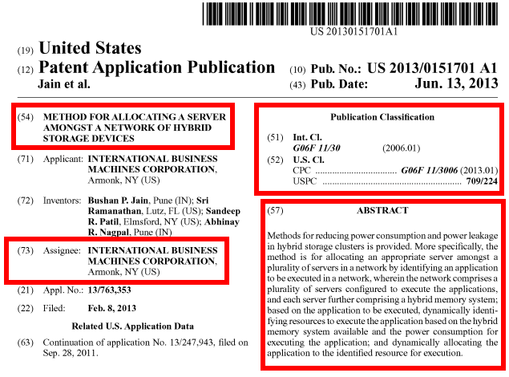

# landscraper - doing the dirty work for intellectual property (IP) decisions

__Contributer: Akhil Jindal__ | https://github.com/akhil-jindal/

---
---
## Table of Contents:

1.) [Introduction](#introduction)

2.) [Brief Background](#background)

3.) [Objectives](#objectives)

4.) [Techniques and Tools](#techniques)

5.) [Results and Conclusions](#results)

6.) [Appendix](#appendix)

---

### Introduction <a name="introduction"></a>

__Problem:__ 

It is difficult to make IP decisions for newly developed technologies, especially early on.

__Types of decisions that need to be made:__

* What intellectual property strategy should we pursue for our technology?
  * Patent
  * Trade secret
  * Other technology transfer mechanisms (e.g., publications, defensive public disclosures, etc.)

* How many and what kinds of 'key players' are practicing in this technology area?
  * Licensing opportunities?
  * Competitors?
  
* Can we forecast impasses in securing protection and enforceability?

* Which aspects of our technology should we focus on for IP protection, and which require further development?

__What is being done now?:__

* Teams consisting of subject matter experts (SMEs), IP attorneys, and business strategists work together

* Intellectual asset management (IAM) tools and Software as a Service (Saas) can assist with these decisions

__Why is this difficult?__

* Captial and time intensive
* Both the newly developed technology and the field to which it corresponds are dynamic
* We suffer from: analysis paralysis, emotional bias, decision fatigue

---
### Brief Background <a name="background"></a>

__What is a patent?__

* A patent is a form of intellectual property. A patent gives its owner the right to exclude others from making, using, selling, and importing an invention for a limited period of time (e.g., twenty years).
* The patent rights are granted in exchange for an enabling public disclosure of the invention (e.g., a patent application)

__What a patent application looks like:__

In red boxes below are the portions of the patent application that ___landscraper___ relies upon, namely:
* Title
* Assignee - who has the right to the patent
* Publication Classification - granular classification of the patented invention
* Abstract - 150 word (or less) description
* Detailed description - an exhaustive description, encompassing all proposed embodiments, variations and applications
* Claims (legal term) - describes the extent (i.e. the scope, of the protection conferred by a patent) or the protection sought in a patent application



<center> ........ </center> 


<center> ........ </center> 


__What does 'patentability' mean?:__

US patent laws usually require that, for an invention to be patentable, it must be:

* Patentable subject matter (i.e., a kind of subject-matter eligible for patent protection)
* Novel (i.e. at least some aspect of it must be new)
* Non-obvious
* Useful

__How many and what kinds of classifications are there for 'patentable subject matter'?:__

Here is a list of [Cooperative Patent Classifications (CPC)](https://www.uspto.gov/web/patents/classification/cpc/html/cpc.html).  I encourage you to navigate through this list to see just how granular the classifications are and to get a sense of the breadth of technologies that have been patented.


---
### Objectives <a name="objectives"></a>

__Goal:__

A user can input a sample patent application (i.e., a target patent application) and ___landscraper___ will provide a starting point for understanding the 'patent landscape' with information such as:
* Classification(s) corresponding to the target patent application
* Top patent publications that are most similar to the target patent application
* Identifies 'key players' for your target patent application

__Assumptions and Approach:__

* Currently, ___landscraper___ will only be able to process results for several computer technology subject matter areas, currently it's one of the [top areas that the U.S. is seeking IP protection in](https://www.wipo.int/edocs/infogdocs/en/ipfactsandfigures2018/).
  * CPC Class G06 represents a computing, counting and calculating class and coveres:
    * simulators which are concerned with the mathematics of computing the existing or anticipated conditions within the real device or system;
    * simulators which demonstrate, by means involving computing, the function of apparatus or of a system, if no provision exists elsewhere;
    * image data processing or generation.
  * [G06 sub-classifications used for training](https://www.uspto.gov/web/patents/classification/cpc/html/cpc-G.html#G06):
    * G06C - Digital computer in which all the computation is effected mechanically
    * G06D - Digital fluid-pressure computing devices
    * G06E - Optical computing devices
    * G06F - Electric digital data processing
    * G06G - Analogue computers
    * G06J - Hybrid computing arrangements
    * G06K - Recognition of data, presentation of data, record carriers, ahndling record carriers
    * G06M - Counting mechanisms; counting of objects not otherwise provided for
    * G06N - Computer systems based on specific computational models
    * G06Q - Data processing systems or methods, specifically adapted for admininstrative, commercial financial,  managerial superviory or forecasting purposes
    * G06T - Image data processing or generation, in general
* Only published patent applications available from https://patents.google.com and of U.S. origin were used in the development and application of ___landscraper___

* Select portions of a patent publication were used in the development and application (see: [Brief Background](#background)), rather than the entire document as well as other related documentation (e.g., prosecution history, litigation outcomes, etc.).

---

### Techniques and Tools <a name="techniques"></a>

---

### Results and Conclusions <a name="results"></a>

---

### Appendix <a name="results"></a>

---


```python

```
